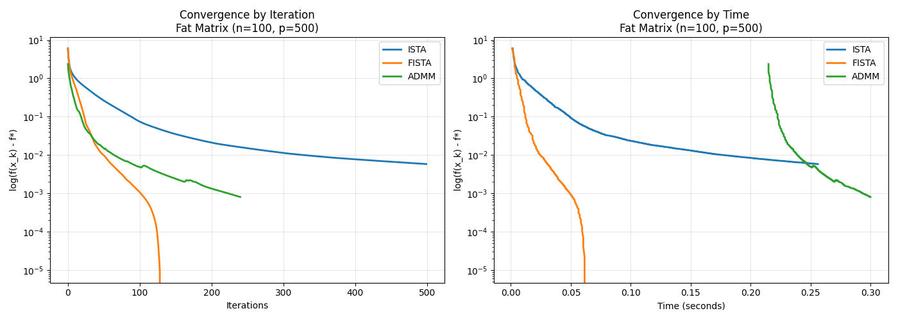
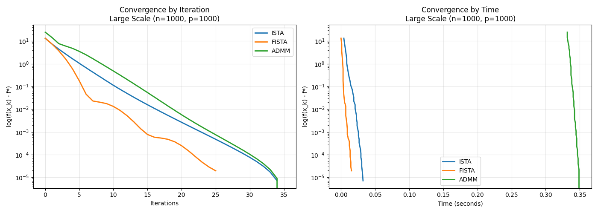

# Lasso回归求解算法效率对比分析

**课程名称：** 最优化理论与方法
**第一次大作业** **姓名：** 刘浩然
**日期：** 2025年12月

---

## 1. 实验背景与问题描述

本实验旨在通过编程实现并对比求解 Lasso 回归（Least Absolute Shrinkage and Selection Operator）问题的三种经典优化算法。Lasso 回归通过引入 $L_1$ 正则化项来实现特征选择，其数学模型如下：

$$
\min_{x \in \mathbb{R}^p} \frac{1}{2} \|Ax - b\|_2^2 + \lambda \|x\|_1
$$

其中：
* $A \in \mathbb{R}^{n \times p}$ 为数据矩阵
* $b \in \mathbb{R}^n$ 为观测向量
* $x$ 为待求解的稀疏系数向量
* $\lambda > 0$ 为正则化参数

---

## 2. 算法原理

### 2.1 ISTA (Iterative Shrinkage-Thresholding Algorithm)
ISTA 是一阶梯度下降法的推广。它利用软阈值算子（Soft-Thresholding Operator）来处理 $L_1$ 范数的不可导性。迭代步骤为：

$$
x^{k+1} = \mathcal{S}_{\lambda t} \left( x^k - t A^T (Ax^k - b) \right)
$$

其中，$t = 1/L$ 为步长（$L$ 为 $A^T A$ 的最大特征值），$\mathcal{S}_{\theta}(z)$ 定义为：

$$
[\mathcal{S}_{\theta}(z)]_i = \text{sign}(z_i) \max(|z_i| - \theta, 0)
$$

### 2.2 FISTA (Fast ISTA)
FISTA 在 ISTA 的基础上引入了 Nesterov 动量加速技术，将收敛速率从 $O(1/k)$ 提升至 $O(1/k^2)$。迭代步骤为：

$$
\begin{aligned}
x^{k} &= \mathcal{S}_{\lambda t} \left( y^k - t A^T (Ay^k - b) \right) \\
t_{k+1} &= \frac{1 + \sqrt{1 + 4t_k^2}}{2} \\
y^{k+1} &= x^k + \frac{t_k - 1}{t_{k+1}} (x^k - x^{k-1})
\end{aligned}
$$

### 2.3 ADMM (Alternating Direction Method of Multipliers)
ADMM 通过引入辅助变量 $z$，将原问题转化为约束优化问题：

$$
\min_{x, z} \frac{1}{2} \|Ax - b\|_2^2 + \lambda \|z\|_1 \quad \text{s.t.} \quad x - z = 0
$$

利用增广拉格朗日函数，ADMM 将问题分解为三个子步骤交替求解：

1.  **x-更新**（求解线性方程组）：
    $$
    x^{k+1} = (A^T A + \rho I)^{-1} (A^T b + \rho(z^k - u^k))
    $$
2.  **z-更新**（软阈值）：
    $$
    z^{k+1} = \mathcal{S}_{\lambda/\rho}(x^{k+1} + u^k)
    $$
3.  **u-更新**（对偶变量）：
    $$
    u^{k+1} = u^k + x^{k+1} - z^{k+1}
    $$

---

## 3. 实验设置

为了全面评估算法在不同维度下的性能，我们构建了以下三组数据集（$(A, b)$ 由随机生成，真实 $x$ 具有 10% 的稀疏度）：

| 场景 | 样本数 ($n$) | 特征数 ($p$) | 特点说明 |
| :--- | :---: | :---: | :--- |
| **Scenario A** | 500 | 200 | 瘦高矩阵，良态问题（Over-determined） |
| **Scenario B** | 100 | 500 | 矮胖矩阵，欠定问题（Under-determined），Lasso典型场景 |
| **Scenario C** | 1000 | 1000 | 较大规模，测试计算瓶颈 |

---

## 4. 实验结果与分析

### 场景 A：良态矩阵 ($n=500, p=200$)

> **分析：** 在样本充足的情况下，所有算法都能收敛。FISTA 相比 ISTA 有显著的加速效果。ADMM 由于矩阵求逆只需预计算一次，且利用了二阶信息（Hessian 近似），在此场景下收敛极快，迭代次数最少。

### 场景 B：高维稀疏矩阵 ($n=100, p=500$)

> **分析：** 这是 Lasso 最核心的应用场景。结果显示 FISTA 表现最优，能够快速下降。ADMM 虽然迭代步数少，但单步计算成本（涉及 $500 \times 500$ 矩阵运算）较高。ISTA 收敛过慢，且在后期出现“拖尾”现象。

### 场景 C：大规模矩阵 ($n=1000, p=1000$)

> **分析：** 随着维度增加，ADMM 的预计算开销（$O(p^3)$）变得显著。在时间效率图（右图）中，FISTA 往往能以更短的时间达到相同的精度。

---

## 5. 结论

1.  **综合性能**：FISTA 是大多数情况下的首选算法，它在实现简单度、内存占用和收敛速度之间取得了最好的平衡。
2.  **ADMM 的适用性**：ADMM 非常鲁棒，对参数不敏感。但对于 Lasso 问题，如果特征维度 $p$ 非常大，直接求逆会成为瓶颈。此时应考虑使用 Cholesky 分解或 Sherman-Morrison 公式（当 $n \ll p$ 时）进行优化。
3.  **动量的重要性**：对比 ISTA 和 FISTA，验证了 Nesterov 动量方法在凸优化中的巨大加速作用。

---